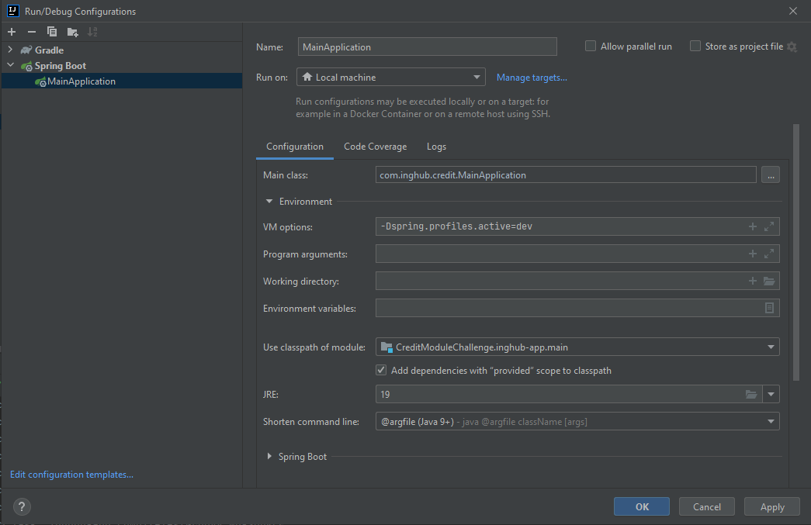

# Project Name

INGHUB Credit Module Challenge

## Description

This Spring Boot application provides a backend API for managing customer and loan data. 

## Getting Started

### Dependencies

* Java 19
* Spring Boot 3.2.1 or higher
* Gradle 8.11.1

### Installing

* Clone the repository using Git:

git clone https://github.com/yurtalangokhan/Credit-Module.git

* cd Credit-Module
* docker compose -f docker-compose.yml -p inghub-stack up -d --build --force-recreate

* gradle clean build
* Debug mode configuration:
  
  
 * After running the code and creating the database, change the create on 
    jpa/hibernate/ddl-auto: create property from address Credit-Module\inghub-app\src\main\resources to update!

###API Reference
* Access the application at http://localhost:9050/
* Swagger UI can be accessed at http://localhost:9050/swagger-ui/index.html for API documentation and testing.
* The Postman collection is in the directory named inghub.postman_collection.json.

